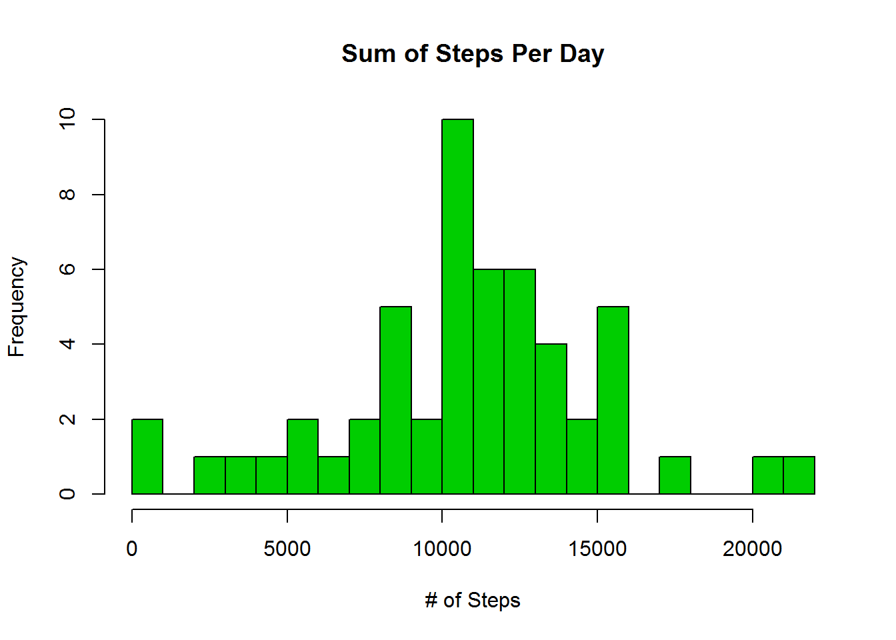
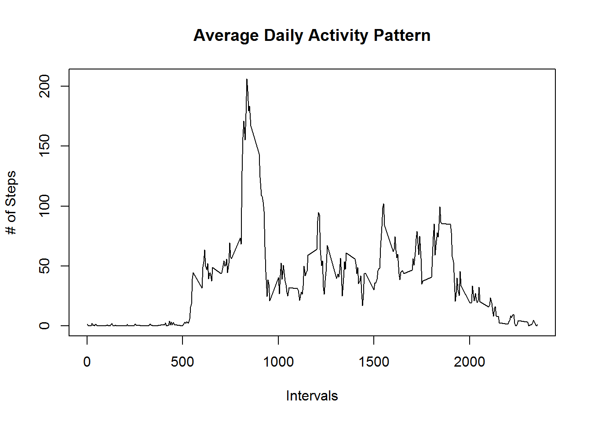
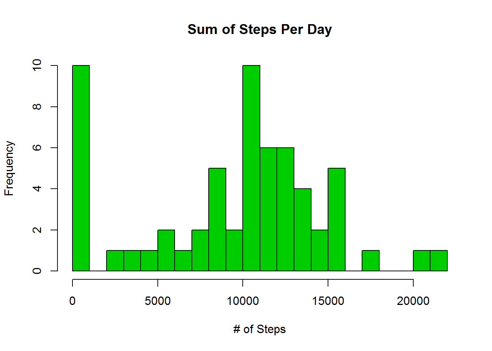
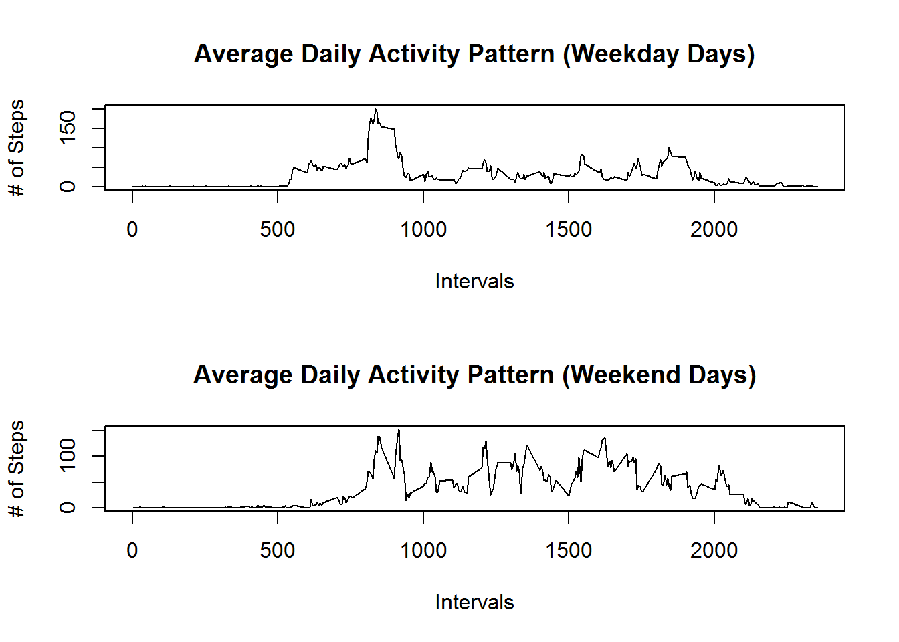

#Reproducible Research
Coursera Project 1
====================================================================
********************************************************************

###Loading and preprocessing the data

Read the CSV file into R:

```r
activity<-read.csv("activity.csv", header=TRUE, sep=",")
```

Subset the data for no missing steps data:

```r
act_nomiss<-activity[which(!is.na(activity$steps)), ]
```

###What is mean total number of steps taken per day?

Aggregate sum of steps by date:

```r
dailysteps<-aggregate(steps~date,act_nomiss,sum)
```

Create a histogram of the sum of steps by day (freq. indicates # of days):

```r
hist(dailysteps$steps,xlab="# of Steps",main="Sum of Steps Per Day", col=19, breaks=30)
```

<!-- -->

Calculate mean and median:

```r
step_mean<-mean(dailysteps$steps)
step_median<-median(dailysteps$steps)
```

The mean steps per day is...

```
## [1] 10766.19
```

The median steps per day is...

```
## [1] 10765
```

###What is the average daily activity pattern?

Aggregate mean steps by interval:

```r
intervalsteps<-aggregate(steps~interval,act_nomiss,mean)
```

Plot the average steps by interval (all days):

```r
plot(intervalsteps$interval,intervalsteps$steps,type="l",main="Average Daily Activity Pattern",xlab="Intervals",ylab="# of Steps")
```

<!-- -->

Locate which interval has the highest average number of steps:

```r
max<-intervalsteps[which.max(intervalsteps$steps),1]
```

Across all days, the average interval with the maximum number of steps is...

```
## [1] 835
```

###Imputing missing values for a new dataset

Count cases with NA steps:

```r
count_NA<-sum(!complete.cases(activity$steps))
count_NA
```

```
## [1] 2304
```

My chosen strategy for missing data imputation is mean substitution:

```r
imputed<-transform(activity, steps = ifelse(is.na(activity$steps),(intervalsteps$steps %in% activity$interval),activity$steps))
```

Aggregate sum of steps by date (Imputed Data):

```r
imputedsteps<-aggregate(steps~date,imputed,sum)
```

Create a histogram of the sum of steps by day (freq. indicates # of days):

```r
hist(imputedsteps$steps,xlab="# of Steps",main="Sum of Steps Per Day", col=19, breaks=30)
```

<!-- -->

Calculate mean and median:

```r
imputedsteps_mean<-mean(imputedsteps$steps)
imputedsteps_median<-median(imputedsteps$steps)
```

The mean steps per day is...

```
## [1] 9356.721
```

The median steps per day is...

```
## [1] 10395
```

**Do these values differ from the estimates from the first section of the assignment?**
Yes, imputation of missing step data via mean substitution provides different results.
**What is the impact of imputing missing data on the estimates of the total daily number of steps?**
The estimates of total dialy number of steps are lowered significantly.
Mean daily steps drops from 10,766.19 to 9,356.721.
Median daily steps drops from 10,765 to 10,395.
*In summary, the exclusion of missing values provided inflated estimates of daily steps.*

###Are there differences in activity patterns between weekdays and weekends?

Compute a factor variable that says if the observation was from a Weekday or on the Weekend:

```r
imputed$day<-weekdays(as.Date(imputed$date))
imputed$daystat<-factor(ifelse(!(imputed$day=="Saturday"|imputed$day=="Sunday"),"Weekday","Weekend"))
```

Make a 2-panel plot comparing average activity patterns between weekdays and weekends.

```r
imputed_MFave<-aggregate(steps~interval,subset(imputed,daystat=="Weekday"),mean)
imputed_SSave<-aggregate(steps~interval,subset(imputed,daystat=="Weekend"),mean)
par(mfrow=c(2,1))
plot(imputed_MFave$interval,imputed_MFave$steps,type="l",main="Average Daily Activity Pattern (Weekday Days)",xlab="Intervals",ylab="# of Steps")
plot(imputed_SSave$interval,imputed_SSave$steps,type="l",main="Average Daily Activity Pattern (Weekend Days)",xlab="Intervals",ylab="# of Steps")
```

<!-- -->

**Unsurprisingly, we can see that our subject sleeps in on weekend days!        :)  **

The subject also appears to generally be more active during the weekend.

Thanks for reading!


